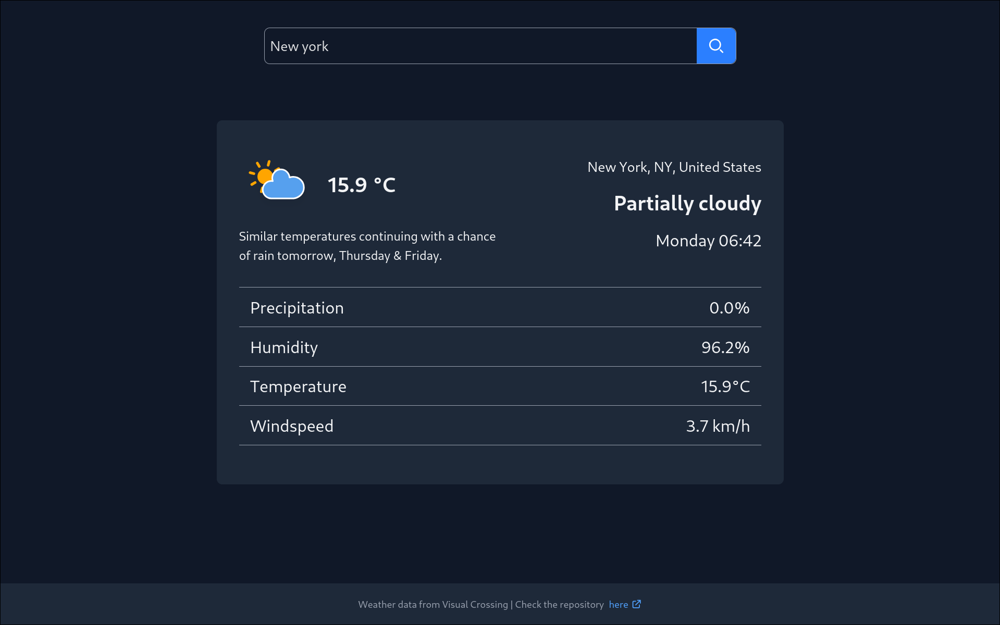

# Weather App

> A real-time weather dashboard built as part of my journey through [The Odin Project](https://www.theodinproject.com/) fullstack curriculum. While the original assignment uses JavaScript and classic tooling, I chose to build it with TypeScript and a modern stack (Vite, Tailwind, Zod, etc.) to deepen my skills and create a more robust, maintainable app.

---
Visit the demo [here](https://fran-dv.github.io/weather-app/)



---

## Table of Contents
- [About the Project](#about-the-project)
- [What I Learned](#what-i-learned)
- [Features](#features)
- [Tech Stack & Tools](#tech-stack--tools)
- [Project Structure](#project-structure)

---

## About the Project
This project is a real-time weather dashboard that lets users search for weather data by location, view current conditions, and see details like temperature, wind speed, and more. The app is fully responsive and built following modern web development best practices.

It was originally based on an [assignment from The Odin Project](https://www.theodinproject.com/lessons/node-path-javascript-weather-app), in the Asynchronous JavaScript and APIs section. Instead of using the default setup (JavaScript, webpack and so on), I decided to build it from scratch using TypeScript and a more modern toolchain. My goal was to strengthen my understanding of scalable frontend codebases, and in the process, I ended up learning a lot more than expected, as detailed below.

---

## What I Learned
- Handling asynchronous data fetching from third-party APIs with proper error handling
- Using [zod](https://zod.dev/) to validate and adapt API responses to fit my interfaces, which keeps the code highly maintainable. This made it easy to migrate from ip-api to ipapi.co by simply updating the schema and the adapter function. You can see this change in the [commit history](https://github.com/fran-dv/weather-app/commit/fc445161595da99d83c59a17bf92ecb497ffe776)
- Styling both static and dynamic elements quickly with Tailwind CSS, while making the layout fully responsive
- Structuring the project with a clear and organized system, separating concerns such as UI, core logic, and API integration

...and many small insights that added up throughout the process.

---

## Features
- 🌤️ Fetches real-time weather data from an external API
- 🔍 Search by city name with error handling for invalid queries
- 🌡️ Toggle temperature and wind speed units dynamically
- ⚡ Fast, responsive UI across mobile and desktop
- 🧩 Modular, component-based code organization
- 🛡️ Type-safe codebase

---

## Tech Stack & Tools
- **TypeScript** — Type safety and modern JavaScript features
- **Vite** — lightning-fast build tool and development server
- **Tailwind CSS** — CSS framework
- **Zod** — TypeScript-first schema validation
- **@fran-dv/ui-components** — Reusable components built by me
- **date-fns** — lightweight date formatting utilities
- **Bun** — JavaScript runtime (for package manager and scripts)
- **Visual Crossing Weather API** — Weather data provider
- **ipapi.co API** - geolocation lookup by IP
- **ESLint** and **Prettier** - code linting and formatting

---

## Project Structure

```
weather-app/
├── src/                    # Application source code
│   ├── assets/              # images and animated icons
│   ├── core/                # Core domain logic
│   │   ├── location/         # Geolocation logic and types
│   │   └── weather/          # Weather data logic and types
│   ├── infraestructure/     # API integrations
│   │   └── api/              # Data fetchers (ipapi, visual-crossing)
│   ├── ui/                  # UI modules
│   │   ├── general/          # General UI staff
│   │   ├── loader/           # Loader logic
│   │   ├── search-bar/       # Search bar logic
│   │   ├── selectors/        # Enums with CSS selectors
│   │   └── weather-info/     # Dynamic weather info generator
│   ├── utilities/           # Utility functions (units converters, etc.)
│   ├── index.css            # Main stylesheet
│   └── main.ts              # App entry point
├── index.html               # Main HTML file
```